# Jira Clone — Entity Relationship Diagram

Data model derived from `force-app/main/default/objects/**`. There are **15 custom objects**
(`*__c`) plus the standard Salesforce **`User`** object. Every relationship below is a
**Lookup** (Salesforce has no FK constraints; `deleteConstraint` governs delete behavior).

- `Restrict` = parent cannot be deleted while children reference it.
- `SetNull` = child reference is cleared when the parent is deleted.
- `Project__c` is the root tenant; most objects hang off it directly or transitively.

---

## Mermaid diagram

```mermaid
erDiagram
    PROJECT__C ||--o{ PROJECTMEMBER__C : "owns members"
    PROJECT__C ||--o{ EPIC__C : "owns epics"
    PROJECT__C ||--o{ SPRINT__C : "owns sprints"
    PROJECT__C ||--o{ STATUS__C : "defines statuses"
    PROJECT__C ||--o{ WORKFLOW__C : "owns workflows"
    PROJECT__C ||--o{ TICKETTYPE__C : "owns ticket types"
    PROJECT__C ||--|| NAMESEQUENCE__C : "owns name sequence (1:1)"

    USER ||--o{ PROJECTMEMBER__C : "identified by membership"

    WORKFLOW__C ||--o{ WORKFLOWTRANSITION__C : "owns transitions"
    WORKFLOW__C ||--o{ TICKETTYPE__C : "applied by ticket types"

    STATUS__C ||--o{ WORKFLOWTRANSITION__C : "is source of (FromStatus)"
    STATUS__C ||--o{ WORKFLOWTRANSITION__C : "is target of (ToStatus)"
    STATUS__C ||--o{ TICKET__C : "current state of ticket"
    STATUS__C |o--o{ SUBTASK__C : "current state of subtask"

    WORKFLOWTRANSITION__C ||--o{ VALIDATEFIELD__C : "owns validation rules"

    TICKETTYPE__C ||--o{ TICKET__C : "categorizes tickets"

    EPIC__C |o--o{ TICKET__C : "groups tickets"
    SPRINT__C |o--o{ TICKET__C : "contains assigned tickets"

    PROJECTMEMBER__C ||--o{ TICKET__C : "creates ticket (Creator)"
    PROJECTMEMBER__C |o--o{ TICKET__C : "is assigned ticket (AssignedTo)"
    PROJECTMEMBER__C ||--o{ TICKETCOMMENT__C : "authors comment (Creator)"
    PROJECTMEMBER__C |o--o{ SUBTASK__C : "is assigned subtask (Assignee)"

    TICKET__C ||--o{ SUBTASK__C : "owns subtasks"
    TICKET__C ||--o{ TICKETCOMMENT__C : "owns comments"
    TICKET__C ||--o{ EPICLINK__C : "linked via epic link"
    TICKET__C ||--o{ TICKETLINK__C : "is source link (LinkedFrom)"
    TICKET__C ||--o{ TICKETLINK__C : "is target link (LinkedTo)"

    EPIC__C ||--o{ EPICLINK__C : "linked via epic link"

    PROJECT__C {
        string Name PK
        string BacklogMaxScore__c
    }

    PROJECTMEMBER__C {
        string Name PK
        lookup Project__c FK "required, Restrict"
        lookup User__c FK "optional, SetNull -> User"
        picklist Role__c
        picklist RecordStatus__c
    }

    EPIC__C {
        string Name PK
        lookup Project__c FK "required, Restrict"
        string Summary__c
        textarea Description__c
        datetime StartDate__c
        datetime EndDate__c
        datetime CreatedAt__c
        datetime UpdatedAt__c
    }

    SPRINT__C {
        string Name PK
        lookup Project__c FK "required, Restrict"
        date StartDate__c
        number Duration__c
        textarea Goal__c
        string MaxScore__c
        number TotalStoryPoint__c
        number TotalEndedStoryPoint__c
        picklist RecordStatus__c
    }

    STATUS__C {
        string Name PK
        lookup Project__c FK "required, Restrict"
        boolean isStart__c
        boolean isEnd__c
        picklist RecordStatus__c
    }

    WORKFLOW__C {
        string Name PK
        lookup Project__c FK "required, Restrict"
        picklist RecordStatus__c
    }

    WORKFLOWTRANSITION__C {
        string Name PK
        lookup Workflow__c FK "required, Restrict"
        lookup FromStatus__c FK "required, Restrict -> Status"
        lookup ToStatus__c FK "required, Restrict -> Status"
        picklist RecordStatus__c
    }

    VALIDATEFIELD__C {
        string Name PK
        lookup WorkflowTransition__c FK "required, Restrict"
        picklist FieldName__c
        picklist Type__c
        string ErrorMessage__c
        picklist RecordStatus__c
    }

    TICKETTYPE__C {
        string Name PK
        lookup Project__c FK "required, Restrict"
        lookup Workflow__c FK "required, Restrict"
        textarea Description__c
        string IconUrl__c
        picklist RecordStatus__c
    }

    TICKET__C {
        string Name PK
        lookup Ticket_Type__c FK "required, Restrict -> TicketType"
        lookup CurrentState__c FK "required, Restrict -> Status"
        lookup Creator__c FK "required, Restrict -> ProjectMember"
        lookup AssignedTo__c FK "optional, SetNull -> ProjectMember"
        lookup Epic__c FK "optional, Restrict"
        lookup Sprint__c FK "optional, SetNull"
        string Summary__c
        textarea Description__c
        datetime StartDate__c
        datetime EndDate__c
        number StoryPoint__c
        string Score__c
        picklist Priority__c
        picklist RecordStatus__c
    }

    SUBTASK__C {
        string Name PK
        lookup Ticket__c FK "required, Restrict"
        lookup Assignee__c FK "optional, SetNull -> ProjectMember"
        lookup CurrentState__c FK "optional, Restrict -> Status"
        string Summary__c
        textarea Description__c
        datetime StartDate__c
        number StoryPoint__c
        picklist RecordStatus__c
    }

    EPICLINK__C {
        string Name PK
        lookup Epic__c FK "required, Restrict"
        lookup Ticket__c FK "required, Restrict"
        text Type__c
        boolean IsActive__c
    }

    TICKETLINK__C {
        string Name PK
        lookup LinkedFromTicket__c FK "required, Restrict -> Ticket"
        lookup LinkedToTicket__c FK "required, Restrict -> Ticket"
        picklist Type__c
        picklist RecordStatus__c
    }

    TICKETCOMMENT__C {
        string Name PK
        lookup Ticket__c FK "required, Restrict"
        lookup Creator__c FK "required, Restrict -> ProjectMember"
        longtext Message__c
        picklist RecordStatus__c
    }

    NAMESEQUENCE__C {
        string Name PK
        lookup Project__c FK "required, Restrict"
        number TicketLastSequence__c
        number SprintLastSequence__c
        number SubtaskLastSequence__c
    }

    USER {
        string Id PK
        string Name
    }
```

---

## Relationship semantics (business meaning + type)

Read each row as a sentence. **Type** is given from the listed direction
(`1:N` = one-to-many, `N:1` = many-to-one, `M:N` = many-to-many via a junction,
`1:1` = one-to-one). Salesforce lookups are physically N:1 (child → parent);
the "owns/has" rows just state the same link from the parent's side.

### Project (tenant root)

| Relationship | Type | Notes |
|---|---|---|
| **Project** owns **Epics** | 1 : N | Each epic belongs to exactly one project. |
| **Project** owns **Sprints** | 1 : N | |
| **Project** defines **Statuses** | 1 : N | Status pool is per-project. |
| **Project** owns **Workflows** | 1 : N | |
| **Project** owns **Ticket Types** | 1 : N | |
| **Project** has **Members** (ProjectMember) | 1 : N | |
| **Project** owns **Name Sequence** | 1 : 1 | One counter row per project. |
| **Project Member** is identified by a **User** | N : 1 | Optional; many memberships can map to one Salesforce user. |

### Workflow engine

| Relationship | Type | Notes |
|---|---|---|
| **Ticket Type** is applied to a **Workflow** | N : 1 | Multiple ticket types can share the same workflow. |
| **Workflow** owns **Workflow Transitions** | 1 : N | |
| **Workflow Transition** starts from a **Status** (FromStatus) | N : 1 | |
| **Workflow Transition** ends at a **Status** (ToStatus) | N : 1 | |
| **Workflow Transition** owns **Validation Rules** (ValidateField) | 1 : N | |

### Tickets & work items

| Relationship | Type | Notes |
|---|---|---|
| **Ticket** is categorized by a **Ticket Type** | N : 1 | Required. |
| **Ticket** is currently in a **Status** (CurrentState) | N : 1 | Required. |
| **Ticket** is assigned to a **Sprint** | N : 1 | Optional; cleared (SetNull) if sprint deleted. |
| **Ticket** belongs to an **Epic** | N : 1 | Optional direct lookup (separate from EpicLink). |
| **Ticket** is created by a **Project Member** (Creator) | N : 1 | Required. |
| **Ticket** is assigned to a **Project Member** (AssignedTo) | N : 1 | Optional. |
| **Ticket** owns **Subtasks** | 1 : N | |
| **Ticket** owns **Comments** (TicketComment) | 1 : N | |
| **Subtask** is assigned to a **Project Member** (Assignee) | N : 1 | Optional. |
| **Subtask** is currently in a **Status** (CurrentState) | N : 1 | Optional. |
| **Ticket Comment** is authored by a **Project Member** (Creator) | N : 1 | Required. |

### Junctions / link objects

| Relationship | Type | Notes |
|---|---|---|
| **Epic** ↔ **Ticket** via **EpicLink** | M : N | EpicLink is the junction (typed, `IsActive__c`). |
| **Ticket** ↔ **Ticket** via **TicketLink** | M : N (self) | Directional: `LinkedFromTicket__c` → `LinkedToTicket__c`. |

---

## Relationship reference

| Child object | Lookup field | → Parent object | Required | On parent delete |
|---|---|---|---|---|
| ProjectMember__c | Project__c | Project__c | ✔ | Restrict |
| ProjectMember__c | User__c | User (standard) | — | SetNull |
| Epic__c | Project__c | Project__c | ✔ | Restrict |
| Sprint__c | Project__c | Project__c | ✔ | Restrict |
| Status__c | Project__c | Project__c | ✔ | Restrict |
| Workflow__c | Project__c | Project__c | ✔ | Restrict |
| TicketType__c | Project__c | Project__c | ✔ | Restrict |
| TicketType__c | Workflow__c | Workflow__c | ✔ | Restrict |
| NameSequence__c | Project__c | Project__c | ✔ | Restrict |
| WorkflowTransition__c | Workflow__c | Workflow__c | ✔ | Restrict |
| WorkflowTransition__c | FromStatus__c | Status__c | ✔ | Restrict |
| WorkflowTransition__c | ToStatus__c | Status__c | ✔ | Restrict |
| ValidateField__c | WorkflowTransition__c | WorkflowTransition__c | ✔ | Restrict |
| Ticket__c | Ticket_Type__c | TicketType__c | ✔ | Restrict |
| Ticket__c | CurrentState__c | Status__c | ✔ | Restrict |
| Ticket__c | Creator__c | ProjectMember__c | ✔ | Restrict |
| Ticket__c | AssignedTo__c | ProjectMember__c | — | SetNull |
| Ticket__c | Epic__c | Epic__c | — | Restrict |
| Ticket__c | Sprint__c | Sprint__c | — | SetNull |
| Subtask__c | Ticket__c | Ticket__c | ✔ | Restrict |
| Subtask__c | Assignee__c | ProjectMember__c | — | SetNull |
| Subtask__c | CurrentState__c | Status__c | — | Restrict |
| EpicLink__c | Epic__c | Epic__c | ✔ | Restrict |
| EpicLink__c | Ticket__c | Ticket__c | ✔ | Restrict |
| TicketLink__c | LinkedFromTicket__c | Ticket__c | ✔ | Restrict |
| TicketLink__c | LinkedToTicket__c | Ticket__c | ✔ | Restrict |
| TicketComment__c | Ticket__c | Ticket__c | ✔ | Restrict |
| TicketComment__c | Creator__c | ProjectMember__c | ✔ | Restrict |

---

## Notes

- **`EpicLink__c`** and **`TicketLink__c`** are junction-style objects:
  `EpicLink__c` links an `Epic__c` to a `Ticket__c` (typed, activatable);
  `TicketLink__c` is a self-referential link between two `Ticket__c` records
  (directional via `LinkedFromTicket__c` / `LinkedToTicket__c`).
- **`NameSequence__c`** holds one row per project to generate sequential ticket/sprint/subtask
  names — it is a counter table, not a business entity.
- **`RecordStatus__c`** (Picklist) appears on most objects and drives the project's
  soft-delete convention; `Epic__c`, `EpicLink__c`, `Project__c`, and `NameSequence__c`
  do not carry it.
- All objects also have the standard Salesforce `Name` field (used as the display key / PK above).
