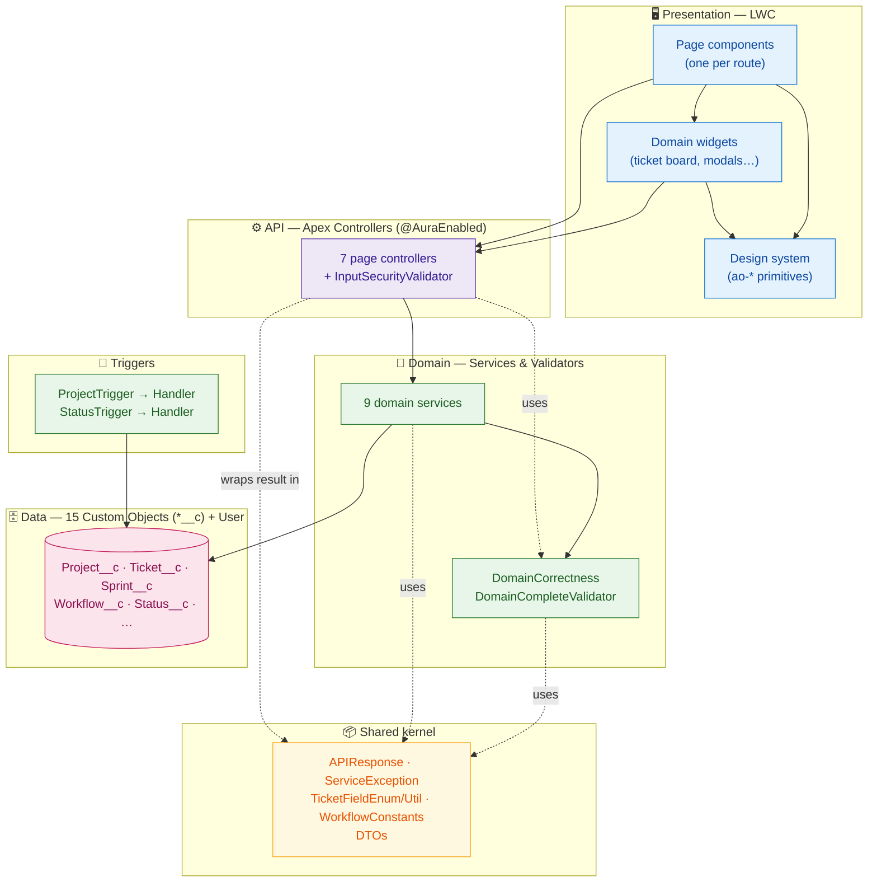
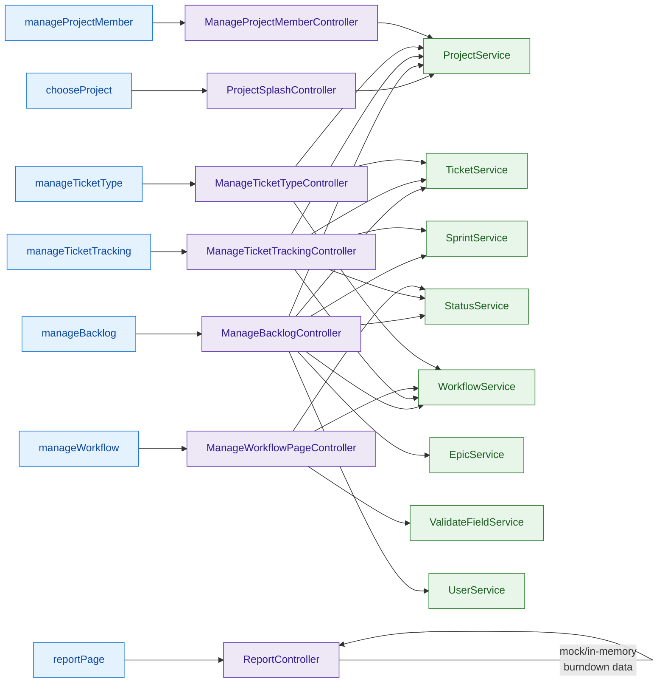
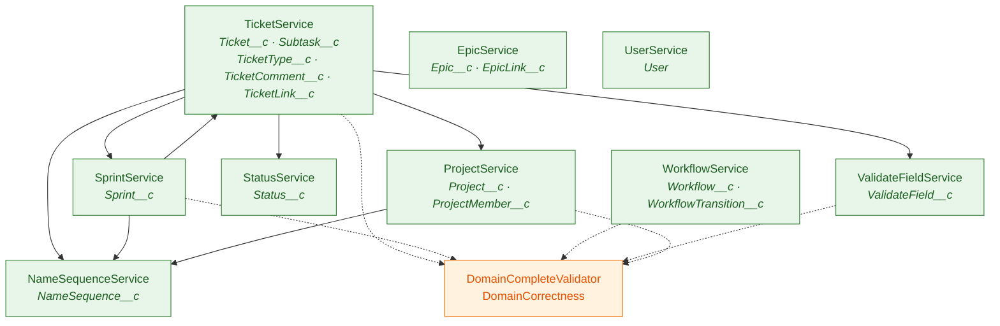
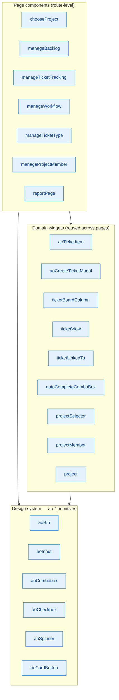

# Jira Clone — System Architecture

Module architecture derived from `force-app/main/default/**`. The app is a layered
Salesforce application:

```
LWC (UI)  →  Apex Controllers (@AuraEnabled API)  →  Domain Services  →  Custom Objects (data)
```

Cross-cutting concerns (shared kernel, DTOs, validators, triggers) sit beside these layers.
Two architectural rules drive the design (see [project memory](#conventions)):

- **One controller per page** — each LWC page talks to exactly one Apex controller.
- **Service isolation** — each domain service SOQL/DMLs **only its own object**; any
  cross-object read/write goes *through the owning service* (e.g. `TicketService` never
  queries `Sprint__c`; it calls `SprintService`).

---

## 1. Layered architecture (high level)



---

## 2. Feature modules (page → controller → services → objects)

Each row is one self-contained feature. The controller is the only entry point the LWC
page calls; it fans out to the domain services it needs.



> **Note:** `ReportController` currently builds the burndown chart from hard-coded
> in-memory history rows (no service / SOQL yet) — it's the one controller without a
> service dependency.

---

## 3. Domain service dependency graph

Services collaborate **only** through other services (never by querying a foreign
object). Validators are shared by all services.



> `SprintService` and `TicketService` call each other (sprint completion clears tickets;
> ticket state changes roll story points up to the sprint) — the only bidirectional pair.

---

## 4. LWC component breakdown



Each page bundles its own co-located `*Validator.js` / `*Utils.js` helpers
(e.g. `backlogTicketValidator.js`, `workflowUtils.js`) for client-side validation and
view-model derivation — keeping business rules out of the templates.

---

## 5. Module inventory

| Layer | Module | Responsibility |
|---|---|---|
| **UI – pages** | `chooseProject` | Project picker / splash |
| | `manageBacklog` | Backlog, sprints, epics, ticket CRUD |
| | `manageTicketTracking` | Active-sprint board & ticket workflow |
| | `manageWorkflow` | Workflow / transition / validation-rule editor |
| | `manageTicketType` | Ticket-type config + workflow binding |
| | `manageProjectMember` | Project membership & roles |
| | `reportPage` | Burndown / reporting |
| **UI – widgets** | `aoTicketItem`, `aoCreateTicketModal`, `ticketBoardColumn`, `ticketView`, `ticketLinkedTo`, `autoCompleteComboBox`, `projectSelector`, `projectMember`, `project` | Reusable feature widgets |
| **UI – design system** | `aoBtn`, `aoInput`, `aoCombobox`, `aoCheckbox`, `aoSpinner`, `aoCardButton` | Branded UI primitives |
| **API** | `ProjectSplashController`, `ManageBacklogController`, `ManageTicketTrackingController`, `ManageWorkflowPageController`, `ManageTicketTypeController`, `ManageProjectMemberController`, `ReportController` | `@AuraEnabled` endpoints, one per page |
| | `InputSecurityValidator` | Cross-cutting input sanitization |
| **Domain** | `ProjectService`, `TicketService`, `SprintService`, `StatusService`, `WorkflowService`, `EpicService`, `ValidateFieldService`, `NameSequenceService`, `UserService` | Business logic + persistence, scoped to one object each |
| | `DomainCorrectness`, `DomainCompleteValidator` | Existence/input correctness vs. business-rule validation |
| **Triggers** | `ProjectTrigger`→`ProjectTriggerHandler`, `StatusTrigger`→`StatusTriggerHandler` | Record-level automation |
| **Shared** | `APIResponse`, `ServiceException`, `TicketFieldEnum`, `TicketFieldUtil`, `WorkflowConstants` | Kernel utilities |
| | `CreateTicketResponse`, `ChangeTicketStateDto`, `TicketLinkToDto`, `TicketCommentDto`, `TicketHistoryDto`, `WorkflowConfigDTO`, `ComparableHistoryRow` | Transport DTOs |
| **Data** | 15 `*__c` custom objects + standard `User` | See [ER_DIAGRAM.md](ER_DIAGRAM.md) |

---

## Conventions

- **`APIResponse`** is the uniform envelope every controller returns (`success`, `message`, `data`).
- **`ServiceException`** is thrown by services and translated to a failed `APIResponse` at the controller boundary.
- **Validators split by intent:** `DomainCorrectness` = "does this exist / is the input well-formed", `DomainCompleteValidator` = named business rules (one method per rule).
- See [ER_DIAGRAM.md](ER_DIAGRAM.md) for the full data model.
