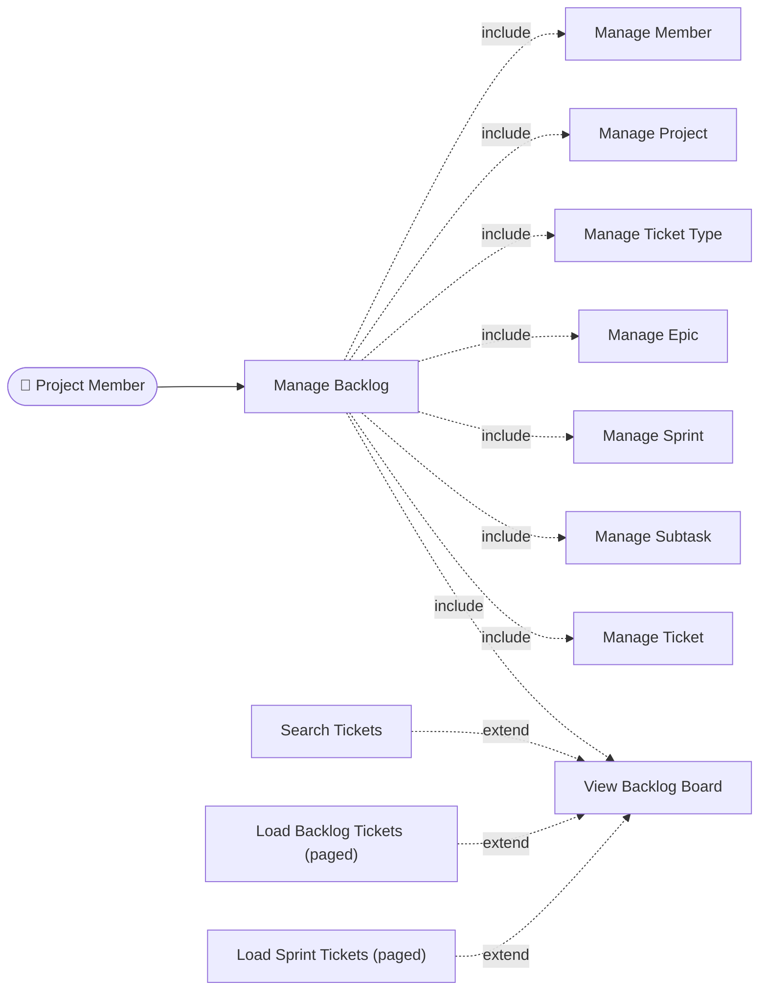
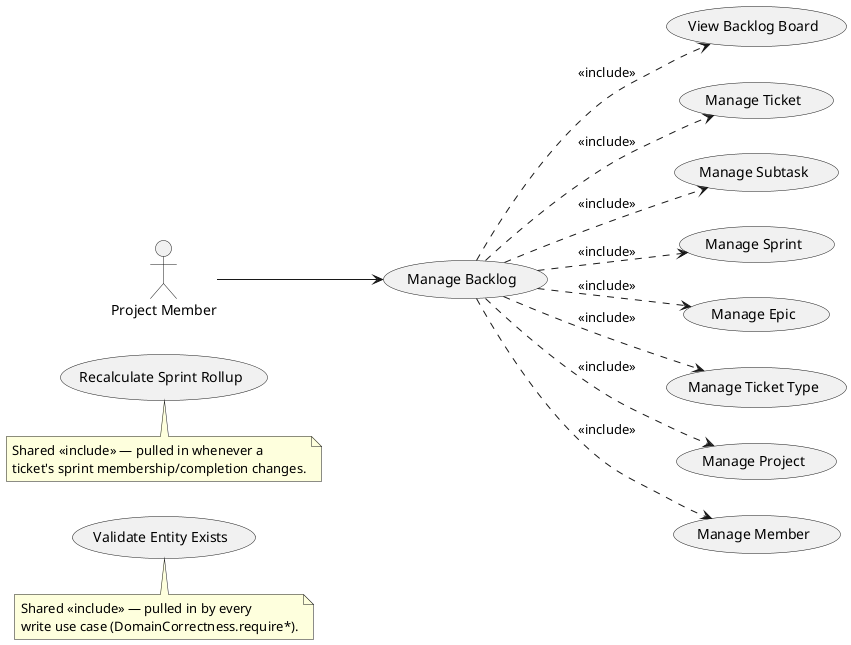
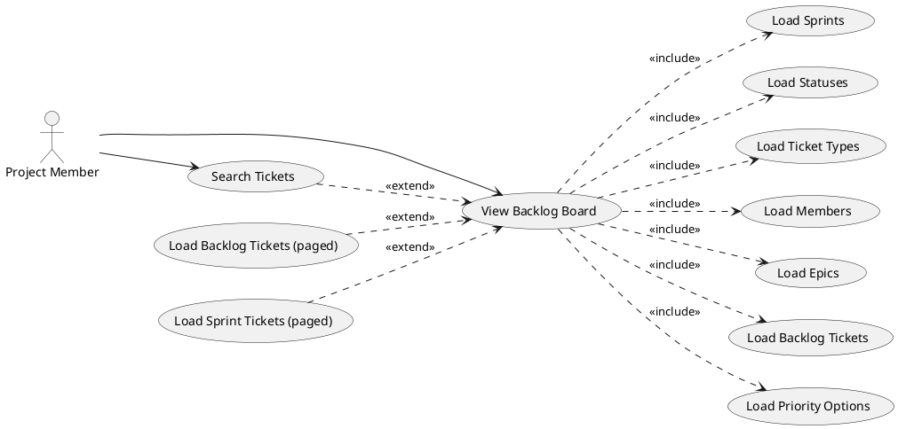
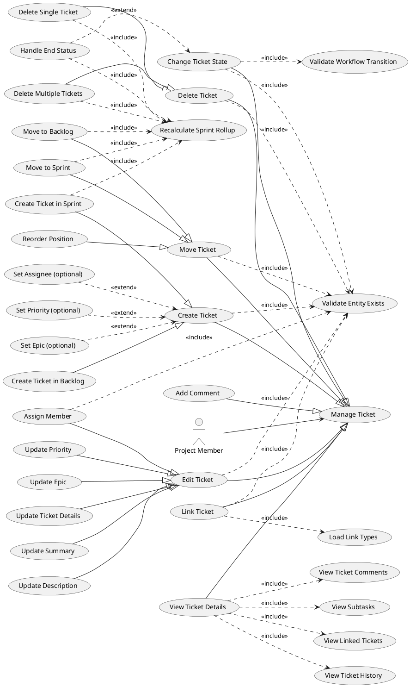
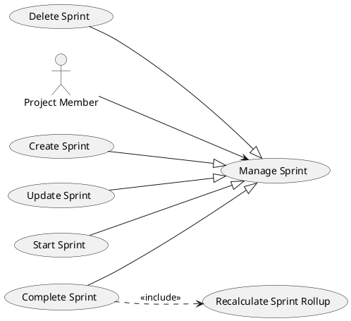
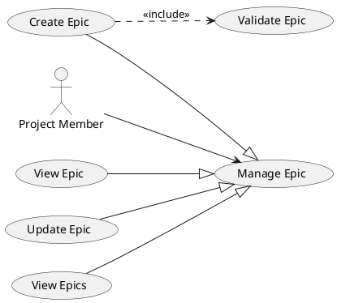
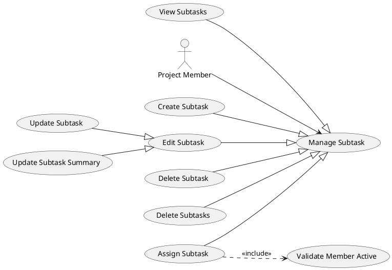
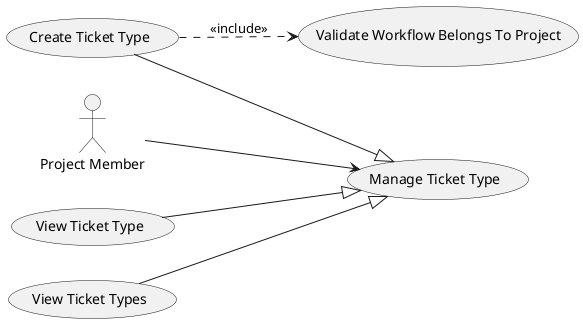
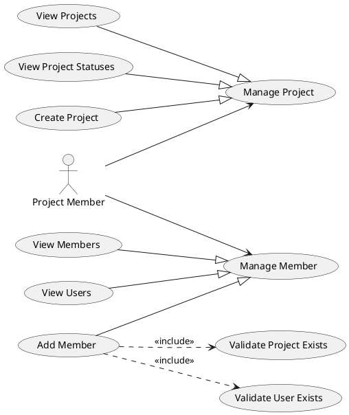

# Use Case Diagram — Manage Backlog

Source: [`ManageBacklogController.cls`](force-app/main/default/classes/controller/managebacklog/ManageBacklogController.cls)

This document models **all 49 endpoints** of the Manage Backlog controller as UML
use cases, grouped under `Manage …` parent use cases, with the four standard
relationships:

| Relationship | Notation | Meaning in this model |
|---|---|---|
| **Association** | `Actor --> UseCase` | The actor performs the use case. |
| **Generalization** | `Child --|> Parent` | The child is a *specialized kind of* the parent (e.g. *Create Ticket in Sprint* is a kind of *Create Ticket*). Hollow triangle points at the parent. |
| **«include»** | `Base ..> Sub : <<include>>` | The base use case **always** runs the sub use case (mandatory sub-behavior, e.g. an aggregate load, sprint recalculation, workflow validation). |
| **«extend»** | `Ext ..> Base : <<extend>>` | The extension runs **only under a condition** (optional field set, end-status reached). Arrow points at the base. |

**Rendering:** PlantUML blocks render in VS Code (PlantUML extension), IntelliJ, or
`plantuml`/Kroki export to `usecase-svg/`. A Mermaid overview is included first for
GitHub-native preview.

---

## Actor

There is a single human actor exposed by this controller — every method is an
`@AuraEnabled` action invoked from the Manage Backlog LWC on behalf of a signed-in
project user. (The controller does **not** branch on role — see *Notes* at the end.)

- **Project Member** — a user working the backlog board (create/edit/move/link
  tickets, run sprints, manage epics, subtasks, members).

Two internal *included* use cases are reused across the model and drawn as shared
nodes rather than repeated 40×:

- **Validate Entity Exists** — every write resolves its inputs through
  `DomainCorrectness.require*` before mutating.
- **Recalculate Sprint Rollup** — any operation that changes a ticket's sprint
  membership or completion returns the recomputed `updatedSprint`.

---

## Overview (Mermaid — GitHub preview)

---

## Diagram 0 — Context / Package Overview (PlantUML)

---

## Diagram 1 — View Backlog Board  *(page bootstrap)*

`loadBacklogData` is one call that aggregates seven sub-loads → all «include».
Search and paged loads are optional refinements of the board → «extend».

---

## Diagram 2 — Manage Ticket  *(the core domain)*

Two-level generalization: `Create / Edit / Move / Delete Ticket` are kinds of
*Manage Ticket*, and each concrete operation is a kind of its parent. Sprint
side-effects and workflow checks are «include»; optional fields and end-status
handling are «extend».

---

## Diagram 3 — Manage Sprint  *(lifecycle)*

Pure generalization from the `Manage Sprint` parent; *Complete Sprint* recomputes
the rollup.

---

## Diagram 4 — Manage Epic

---

## Diagram 5 — Manage Subtask

`Update Subtask Summary` is a specialization of *Edit Subtask*; *Assign Subtask*
includes an active-member check.

---

## Diagram 6 — Manage Ticket Type

*Create Ticket Type* additionally includes a check that the chosen workflow
belongs to the project.

---

## Diagram 7 — Manage Project & Manage Member

---

## Full Traceability — every endpoint → use case → relationships

| # | Controller method | Use case | Parent (generalization) | «include» | «extend» |
|---|---|---|---|---|---|
| 1 | `loadBacklogData` | View Backlog Board | — | Load Sprints, Statuses, Ticket Types, Members, Epics, Backlog Tickets, Priority Options | — |
| 2 | `loadTicketBySearchTerm` | Search Tickets | — | Validate Entity Exists | *extends* View Backlog Board |
| 3 | `linkToTicket` | Link Ticket | Manage Ticket | Validate Entity Exists (×4), Load Link Types | — |
| 4 | `loadProjects` | View Projects | Manage Project | — | — |
| 5 | `getProjectStatuses` | View Project Statuses | Manage Project | Validate Entity Exists | — |
| 6 | `createProject` | Create Project | Manage Project | — | — |
| 7 | `getEpicsByProject` | View Epics | Manage Epic | Validate Entity Exists | — |
| 8 | `getEpicById` | View Epic | Manage Epic | Validate Entity Exists | — |
| 9 | `createEpic` | Create Epic | Manage Epic | Validate Entity Exists, Validate Epic | — |
| 10 | `updateEpic` | Update Epic | Manage Epic | Validate Entity Exists | — |
| 11 | `createSprint` | Create Sprint | Manage Sprint | Validate Entity Exists | — |
| 12 | `updateSprint` | Update Sprint | Manage Sprint | Validate Entity Exists | — |
| 13 | `completeSprint` | Complete Sprint | Manage Sprint | Validate Entity Exists, Recalculate Sprint Rollup | — |
| 14 | `deleteSprint` | Delete Sprint | Manage Sprint | Validate Entity Exists | — |
| 15 | `startSprint` | Start Sprint | Manage Sprint | Validate Entity Exists | — |
| 16 | `loadBacklogTickets` | Load Backlog Tickets (paged) | — | Validate Entity Exists | *extends* View Backlog Board |
| 17 | `loadTicketsBySprint` | Load Sprint Tickets (paged) | — | Validate Entity Exists | *extends* View Backlog Board |
| 18 | `loadTicketTypes` | View Ticket Types | Manage Ticket Type | Validate Entity Exists | — |
| 19 | `getTicketTypeById` | View Ticket Type | Manage Ticket Type | Validate Entity Exists | — |
| 20 | `createTicketType` | Create Ticket Type | Manage Ticket Type | Validate Entity Exists, Validate Workflow Belongs To Project | — |
| 21 | `createTicketFromBacklog` | Create Ticket in Backlog | Create Ticket → Manage Ticket | Validate Entity Exists | Set Epic / Assignee / Priority (optional) |
| 22 | `createTicketFromSprint` | Create Ticket in Sprint | Create Ticket → Manage Ticket | Validate Entity Exists, Recalculate Sprint Rollup | Set Epic / Assignee / Priority (optional) |
| 23 | `updateTicket` | Update Ticket Details | Edit Ticket → Manage Ticket | Validate Entity Exists | — |
| 24 | `updateTicketSummary` | Update Summary | Edit Ticket → Manage Ticket | Validate Entity Exists | — |
| 25 | `updateTicketDescription` | Update Description | Edit Ticket → Manage Ticket | Validate Entity Exists | — |
| 26 | `loadTicketLinkedToType` | Load Link Types | Manage Ticket | — | — |
| 27 | `loadTicketLinkedTo` | View Linked Tickets | Manage Ticket | Validate Entity Exists | — |
| 28 | `updateTicketPriority` | Update Priority | Edit Ticket → Manage Ticket | Validate Entity Exists | — |
| 29 | `assignTicket` | Assign Member | Edit Ticket → Manage Ticket | Validate Entity Exists, Validate Member Active | — |
| 30 | `changeTicketState` | Change Ticket State | Manage Ticket | Validate Entity Exists, Validate Workflow Transition | Handle End Status → Recalculate Sprint Rollup |
| 31 | `moveTicketToSprint` | Move to Sprint | Move Ticket → Manage Ticket | Validate Entity Exists, Recalculate Sprint Rollup | — |
| 32 | `moveTicketPosition` | Reorder Position | Move Ticket → Manage Ticket | Validate Entity Exists | — |
| 33 | `moveTicketToBacklog` | Move to Backlog | Move Ticket → Manage Ticket | Validate Entity Exists, Recalculate Sprint Rollup | — |
| 34 | `deleteTicket` | Delete Single Ticket | Delete Ticket → Manage Ticket | Validate Entity Exists, Recalculate Sprint Rollup | — |
| 35 | `deleteTickets` | Delete Multiple Tickets | Delete Ticket → Manage Ticket | Validate Entity Exists (bulk), Recalculate Sprint Rollup | — |
| 36 | `loadSubtasks` | View Subtasks | Manage Subtask | Validate Entity Exists | — |
| 37 | `loadTicketHistory` | View Ticket History | Manage Ticket | Validate Entity Exists | — |
| 38 | `loadTicketComments` | View Ticket Comments | Manage Ticket | Validate Entity Exists | — |
| 39 | `createTicketComment` | Add Comment | Manage Ticket | Validate Entity Exists | — |
| 40 | `createSubtask` | Create Subtask | Manage Subtask | Validate Entity Exists | — |
| 41 | `updateSubtaskSummary` | Update Subtask Summary | Edit Subtask → Manage Subtask | Validate Entity Exists | — |
| 42 | `updateSubtask` | Update Subtask | Edit Subtask → Manage Subtask | Validate Entity Exists | — |
| 43 | `assignSubtask` | Assign Subtask | Manage Subtask | Validate Entity Exists, Validate Member Active | — |
| 44 | `deleteSubtask` | Delete Subtask | Manage Subtask | Validate Entity Exists | — |
| 45 | `deleteSubtasks` | Delete Subtasks | Manage Subtask | Validate Entity Exists | — |
| 46 | `createMember` | Add Member | Manage Member | Validate User Exists, Validate Project Exists | — |
| 47 | `loadMembers` | View Members | Manage Member | Validate Entity Exists | — |
| 48 | `updateTicketEpic` | Update Epic (ticket) | Edit Ticket → Manage Ticket | Validate Entity Exists | — |
| 49 | `loadUsers` | View Users | Manage Member | — | — |

---

## Modeling notes / caveats

1. **Single actor, no roles.** The controller never branches on user role, so the
   model has one actor (*Project Member*). If the product distinguishes
   Scrum Master vs. Developer permissions, split the actor and re-associate the
   sprint-lifecycle use cases (Start/Complete/Delete Sprint) to the privileged role.
2. **`Validate Entity Exists` is pervasive.** Almost every write «include»s a
   `DomainCorrectness.require*` check. It is drawn once as a shared use case; the
   traceability table lists it per endpoint even where the per-domain diagram omits
   the arrow for readability.
3. **Sprint rollup as «include» vs «extend».** `Change Ticket State` recalculates the
   sprint **only** when the target status is an end status, so that is modeled as an
   «extend» (*Handle End Status*). Where a sprint change is unconditional
   (create-in-sprint, move, delete), it is «include».
4. **Search is drawn as «extend»** of *View Backlog Board* because it is an optional
   refinement of the same board view, not a separate actor goal.
5. **Page-access authorization is currently disabled** in the controller
   (`InputSecurityValidator.validatePageAccessManageBacklog` is commented out at
   `ManageBacklogController.cls:11`). If re-enabled it becomes a shared «include»
   (*Authorize Page Access*) on `Manage Backlog` / *View Backlog Board*.
