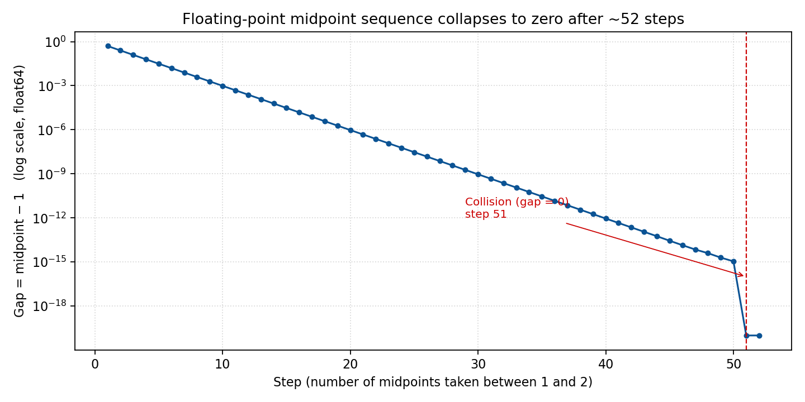

\newpage

# Ticket Ordering with String Scores

**Technical Design Document**

| | |
|---|---|
| **Company** | SoftRetail |
| **Project** | Jira Clone |
| **Author** | Maamoun Youssef |
| **Date** | 2026-05-24 |
| **Version** | 1.1 |
| **Status** | Draft |

\newpage

## Table of Contents

1. Executive Summary
2. Background / Problem Statement
3. Design Study — Alternatives Considered
4. Solution Overview
5. How It Works
6. Business Impact / Benefits
7. Risks & Considerations
8. Technical Appendix *(For Engineers)*

\newpage

## 1. Executive Summary

In the Jira Clone, the order of tickets inside a sprint or the backlog used to
be derived purely from each ticket's **priority** (Critical, High, Medium,
Low), with the end date as a tiebreaker. That gave us broad ordering bands but
**no way for a user to freely arrange tickets** — the cornerstone gesture of
modern backlog tools.

This project delivers true **drag-and-drop ordering**. A single new field,
`Score__c`, stores each ticket's position as a short text value. Reordering
now changes **one row** regardless of how many tickets are in the list, and
the order survives sprint planning sessions of any size without slowing down.

Before settling on a text-based score we evaluated the obvious alternative —
a numeric position field. The study is summarised in §3 and shows why the
numeric approach **cannot scale**: with whole numbers it forces a renumber on
every reorder, and with decimals it runs out of precision within ~50 moves at
the same spot (evidence in the supporting workbook `midpoint_sequence.xlsx`).
The string-based design avoids both failure modes structurally.

\newpage

## 2. Background / Problem Statement

### 2.1 What the system did before

Backlog and sprint queries returned tickets in this order:

```sql
ORDER BY Priority__c ASC, EndDate__c DESC
```

So tickets were grouped by priority band, with the end date as a within-band
tiebreaker.

### 2.2 Why that was not enough

| Symptom | Business cost |
|---|---|
| Users could not **drag and reorder** tickets | The core ceremony of backlog grooming and sprint planning was missing. Teams resorted to spreadsheets and verbal agreements. |
| Within a priority band, order was effectively random from the user's perspective (driven by `EndDate__c`) | "Top of the sprint" had no meaning — two tickets at the same priority would shuffle around as end dates changed. |
| The only way to influence position was to **change priority** | Priority is a *semantic* attribute, not a *positional* one. Forcing users to upgrade a ticket to "Critical" just to keep it visible at the top corrupted reporting and dashboards. |
| No support for stakeholders' real workflow ("put this one above that one regardless of priority") | The product felt rigid; planning meetings worked around the tool instead of through it. |

### 2.3 What we needed

A way to express **explicit relative order** between tickets — independent of
priority — that:

1. Lets the user drop a ticket anywhere in the list.
2. Survives any number of subsequent drops without degrading.
3. Costs the same to save whether the sprint has 5 tickets or 5,000.

\newpage

## 3. Design Study — Alternatives Considered

Before committing to the chosen design, two families of approaches were
studied: a **numeric position field** and a **text-based score**.

### 3.1 Option A — Numeric position field

The instinctive choice: give each ticket a `Position__c` number and sort by
it. Two variants were examined.

#### A.1 Whole-number positions ("renumber on every move")

If positions are integers (`1, 2, 3, 4, 5`), inserting a ticket between
positions 1 and 2 forces the system to **shift every following ticket by
one** so a slot opens up. The cost of one drag-and-drop grows with the size
of the list and the platform must save many rows in a single transaction.

| Property | Behaviour |
|---|---|
| Rows updated per move | **N** — the moved ticket and everyone after it |
| Time to save | Grows with sprint size |
| Risk of platform limit error | Real, and rising as projects grow |

#### A.2 Decimal positions ("take the midpoint")

The textbook fix for integer collisions is to use decimals: drop a ticket
between two others and give it the average of their positions. This buys time
but does not solve the problem — **64-bit floating point precision runs out
after a small number of repeated midpoints in the same neighbourhood**.

The supporting workbook `midpoint_sequence.xlsx` quantifies this. Starting
from `a = 1, b = 2` and repeatedly replacing `b` with `(a + b) / 2`, the gap
between successive midpoints collapses to zero in **51 steps**:

| Step | Right boundary `b` | Computed midpoint |
|---:|---|---|
| 1 | 2.000000000000000 | 1.500000000000000 |
| 10 | 1.001953125000000 | 1.000976562500000 |
| 25 | 1.000000059604645 | 1.000000029802322 |
| 40 | 1.000000000001819 | 1.000000000000909 |
| 50 | 1.000000000000002 | 1.000000000000001 |
| **51** | **1.000000000000001** | **1.000000000000000** |
| 52 | 1.000000000000000 | 1.000000000000000 |

At step 51 the midpoint collides with the lower bound — the computer can no
longer represent a value strictly between them. From that point on, decimals
behave like whole numbers and the system is **forced back into renumbering**.



Roughly fifty drops in the same spot is well within what a real backlog sees
over its lifetime. The decimal variant is therefore **only a deferral**, not
a fix.

### 3.2 Option B — Text-based score *(chosen)*

A short text value, sorted alphabetically, has a property that no fixed-width
number can match: **between any two text values there is always a third**.
Between `"0"` and `"1"` we can use `"01"`. Between `"0"` and `"01"` we can
use `"001"`. There is no precision limit.

Every drop becomes **one write** — only the moved ticket is updated. There is
no renumbering, no collision, no precision floor.

### 3.3 Decision matrix

| Criterion | Option A.1 (integer) | Option A.2 (decimal) | Option B — text *(chosen)* |
|---|---|---|---|
| Rows updated per move | N (whole list shifts) | 1 (until precision runs out) | **1** |
| Robustness over time | Degrades immediately | Degrades around step 51 in any hotspot | **No degradation** |
| Risk of platform limit error | Rises with project size | Latent, surfaces unpredictably | **Eliminated** |
| Implementation complexity | Low | Medium (precision monitoring) | **Low** |

The text-based score wins on every axis.

\newpage

## 4. Solution Overview

### 4.1 The idea in plain language

Every ticket carries a **short text label** called `Score__c`. The list is
displayed in **alphabetical order of that label**. To place a ticket between
two others, the system builds a new label that sits alphabetically between
their two labels. **No other ticket has to change.**

### 4.2 Worked example

Start with three tickets in a sprint, created in order:

| Ticket | Score |
|---|---|
| Ticket 1 | `0` |
| Ticket 2 | `1` |
| Ticket 3 | `2` |

**Action:** the user drags Ticket 3 to sit right after Ticket 1.

**What the system does:**

1. It looks at the ticket currently after Ticket 1 — that's Ticket 2 with
   score `"1"`.
2. It joins the two scores together: `"0"` + `"1"` = `"01"`.
3. It writes `"01"` to Ticket 3 only. No other ticket is touched.

**Result, sorted alphabetically:**

| Position | Ticket | Score |
|---|---|---|
| 1 | Ticket 1 | `0` |
| 2 | **Ticket 3** *(moved)* | `01` |
| 3 | Ticket 2 | `1` |

The order is correct, the user sees the drop happen instantly, and the
database touched **exactly one row**.

\newpage

## 5. How It Works

There are only three moments in the system that involve the score.

### 5.1 Creating a new ticket

The ticket joins the **bottom** of its list (its sprint, or the project's
backlog if it has no sprint).

| Step | What happens |
|---|---|
| 1 | The system looks up the **largest score** currently in that list. |
| 2 | If the list is empty, the new score is `"0"`. |
| 3 | Otherwise, the new score is that largest score with its last character bumped up by one (e.g. `"4"` → `"5"`). |

### 5.2 Listing tickets for the user

| Step | What happens |
|---|---|
| 1 | The database returns tickets ordered by `Score__c` ascending. |
| 2 | The user sees them in that order. No client-side sorting is needed. |

### 5.3 Reordering by drag-and-drop

The user interface sends two ticket IDs: the **moved ticket** and the
**before ticket** — the ticket that should appear *just before* the moved
one in the new order.

| Case | What happens |
|---|---|
| The user dropped the ticket **after** another ticket | The system finds the ticket currently sitting just after the *before ticket*, joins those two scores, and saves that as the moved ticket's new score. |
| The user dropped the ticket at the **top** of the list (no "before") | The system takes the current first ticket's score and produces a label that sorts before it. The moved ticket gets that new label. |
| The *before ticket* is the **last** in the list | The system falls back to the "bump the last character" trick used when creating a ticket. |

In every case, **only the moved ticket is updated.**

\newpage

## 6. Business Impact / Benefits

The chosen design delivers three reinforcing benefits when measured against
the numeric alternative studied in §3. Independently they matter; together
they make the reorder feature **scale-proof**.

### 6.1 Three concrete advantages — vs. the numeric alternative

| # | Advantage | Numeric (renumber) | Text score *(chosen)* |
|---|---|---|---|
| 1 | **Database query performance** | Saving a reorder updates **N rows** per move. | One read for the neighbour, one write for the moved ticket. Cost does not depend on sprint size. |
| 2 | **In-app processing cost (CPU)** | The server builds a list of every following ticket, mutates each one in memory, then dispatches the update. CPU grows with the list. | One assignment, one save. The server-side work is essentially flat. |
| 3 | **Memory used per save (heap)** | All shifted tickets must be held in memory at once to be saved together — heap usage grows with the sprint. | A single ticket in memory regardless of sprint size. |

Advantages 2 and 3 matter **even before considering the database**, because
the platform enforces strict per-transaction CPU and memory budgets. The
chosen design uses a tiny, predictable slice of those budgets, leaving
headroom for everything else running in the same transaction.

### 6.2 What this change unlocks vs. the previous Priority-based ordering

| Question | Before (Priority + EndDate) | After (Score) |
|---|---|---|
| Can a user drag a ticket above another? | No | **Yes** |
| Is "top of the sprint" stable across edits? | No — changes to end dates re-shuffle the list | **Yes — order persists until a user moves something** |
| Must a user change a ticket's priority to influence its position? | Yes — corrupting priority reporting | **No — position and priority are independent** |
| Does the new feature slow down as projects grow? | n/a (feature did not exist) | **No — constant cost per move** |

\newpage

## 7. Risks & Considerations

| Topic | What to know | Mitigation |
|---|---|---|
| **Existing tickets need a starting score** | `Score__c` is required, so any ticket created before this release has no value yet. | A one-time backfill is run as part of the rollout. New environments need no action. |
| **Cross-sprint moves are a separate flow** | The new function only reorders *within* a sprint or *within* a backlog. Moving a ticket from one sprint to another uses a different existing operation. | No change to existing cross-sprint move logic. |
| **Naming of "before ticket"** | The term means *"the ticket that should appear before the moved one in the new order."* | Documented in the engineering appendix and in code comments. |
| **Concatenation edge case** | In a narrowly defined situation, the simple `before + successor` formula can produce a label that sorts in the wrong place. | The edge case is documented; a midpoint-style algorithm is the planned upgrade if it is ever observed in production. |
| **Composite database index** | The fastest query path benefits from a database index on (Sprint, Score). | The single-field index on `Score__c` is deployed as part of this release. The composite index will be requested through Salesforce Support if production query telemetry shows it is needed. |

\newpage

# Technical Appendix *(For Engineers)*

The remainder of this document is for the engineering team. Non-technical
readers can stop here.

## A.1 Data model change

A single new field is introduced on `Ticket__c`:

| Property | Value |
|---|---|
| API name | `Score__c` |
| Label | Score |
| Type | Text(255) |
| Required | Yes |
| File | `force-app/main/default/objects/Ticket__c/fields/Score__c.field-meta.xml` |

```xml
<?xml version="1.0" encoding="UTF-8"?>
<CustomField xmlns="http://soap.sforce.com/2006/04/metadata">
    <fullName>Score__c</fullName>
    <description>Lexicographic ordering key within a sprint or backlog.
        Assigned by Apex on insert and updated on drag/drop reorder. Sort ASC.</description>
    <externalId>false</externalId>
    <label>Score</label>
    <length>255</length>
    <required>true</required>
    <trackTrending>false</trackTrending>
    <type>Text</type>
    <unique>false</unique>
</CustomField>
```

## A.2 Previous ordering — exact SOQL

For completeness, the queries that were replaced:

```apex
// loadBacklogTickets — before
ORDER BY Priority__c ASC, EndDate__c DESC

// getActiveTicketsBySprintOrderByPriorityAsc — before
ORDER BY Priority__c ASC, EndDate__c DESC

// loadActiveTicketsBySprint — before
ORDER BY Priority__c ASC
```

All three now end with:

```apex
ORDER BY Score__c ASC NULLS LAST
```

The `NULLS LAST` clause is a defence in depth for any row that escaped the
backfill — it will appear at the very bottom rather than confuse the order.

## A.3 Indexes and lookup pattern

Three indexes work together. Only one is created explicitly:

| Index | Source | Used by |
|---|---|---|
| `Ticket__c.Id` | Built-in primary key | Every controller's `requireTicketExists(ticketId)` call |
| `Ticket__c.Sprint__c` | Implicit — Salesforce auto-indexes every Lookup field | `WHERE Sprint__c = :ticket.Sprint__c` in all score helpers |
| `Ticket__c.Score__c` (single-field) | Deployable: set `<externalId>true</externalId>` on the field XML | `ORDER BY Score__c` and `WHERE Score__c > :before` |
| `Sprint__c + Score__c` (composite) | **Not deployable** — must be requested via Salesforce Support | Paged sprint listing under heavy load |

### Why the "look up by ID, then trust the loaded record" pattern matters

The LWC layer can send any ticket ID, but **we cannot trust the sprint ID it
sends along** — client state can be stale. So no score-changing function
accepts a `sprintId` parameter. Every flow starts by fetching the ticket by
its (indexed) ID, then uses the **sprint value off the loaded record** in
every subsequent query. From that point on `Sprint__c` is guaranteed
consistent, and the indexed `WHERE Sprint__c = :ticket.Sprint__c` lookup is
an index seek rather than a table scan.

```apex
public static Ticket__c requireTicketExists(String ticketId) {
    List<Ticket__c> rows = [
        SELECT Id, ..., Sprint__c, ..., Score__c
        FROM Ticket__c
        WHERE Id = :ticketId AND RecordStatus__c != 'delete'
        LIMIT 1
    ];
    ...
}
```

## A.4 Where the code lives

| Concern | File / symbol |
|---|---|
| Field metadata | `force-app/main/default/objects/Ticket__c/fields/Score__c.field-meta.xml` |
| Score on insert | `prepareTicketForInsert` + `nextScoreForInsert` in `force-app/main/default/classes/domain/TicketService.cls` |
| Sort by score | `loadBacklogTickets`, `getActiveTicketsBySprintOrderByPriorityAsc`, `loadActiveTicketsBySprint` in `TicketService.cls` |
| Reorder | `moveTicketPosition(Ticket__c movedTicket, Ticket__c beforeTicket)` in `TicketService.cls` |
| Helpers | `incrementLastChar`, `previousAsciiChar`, `findSuccessor`, `findFirst`, `projectTicketTypeIds` (all `private` in `TicketService.cls`) |
| Loader hydration | `DomainCorrectness.requireTicketExists` / `requireTicketsExist` updated to include `Score__c` |
| LWC-facing endpoint | `ManageBacklogController.moveTicketPosition(movedTicketId, beforeTicketId)` |
| Tests | `testMoveTicketPositionWithBeforeTicket`, `testMoveTicketPositionWithNullBeforeTicket` in `TicketServiceTest.cls` |

## A.5 The reorder algorithm

```apex
public static Ticket__c moveTicketPosition(Ticket__c movedTicket, Ticket__c beforeTicket) {
    // ── validation ───────────────────────────────────────────────
    if (movedTicket == null) throw new ServiceException('movedTicket is required');
    if (beforeTicket != null) {
        if (movedTicket.Id == beforeTicket.Id) {
            throw new ServiceException('movedTicket and beforeTicket must be different');
        }
        if (movedTicket.Sprint__c != beforeTicket.Sprint__c) {
            throw new ServiceException(
                'movedTicket and beforeTicket must share the same sprint (or both be in the backlog)');
        }
        if (String.isBlank(beforeTicket.Score__c)) {
            throw new ServiceException('beforeTicket has no Score__c — backfill required');
        }
    }

    // ── backlog scope (only when there is no sprint) ────────────
    Set<Id> backlogTypeIds = null;
    if (String.isBlank(movedTicket.Sprint__c)) {
        TicketType__c tt = [
            SELECT Project__c FROM TicketType__c
            WHERE Id = :movedTicket.Ticket_Type__c AND RecordStatus__c != 'delete'
            LIMIT 1
        ];
        backlogTypeIds = projectTicketTypeIds(tt.Project__c);
    }

    // ── compute the new score ───────────────────────────────────
    String newScore;
    if (beforeTicket != null) {
        Ticket__c successor = findSuccessor(movedTicket, beforeTicket.Score__c, backlogTypeIds);
        newScore = (successor == null)
            ? incrementLastChar(beforeTicket.Score__c)
            : beforeTicket.Score__c + successor.Score__c;
    } else {
        Ticket__c first = findFirst(movedTicket, backlogTypeIds);
        newScore = (first == null) ? '0' : previousAsciiChar(first.Score__c);
    }

    // ── one-row write ───────────────────────────────────────────
    movedTicket.Score__c = newScore;
    update movedTicket;
    return movedTicket;
}
```

The helpers are deliberately tiny:

```apex
private static String incrementLastChar(String s) {
    if (String.isBlank(s)) return '0';
    Integer last = s.charAt(s.length() - 1);
    String next = String.fromCharArray(new List<Integer>{ last + 1 });
    return s.substring(0, s.length() - 1) + next;
}

private static String previousAsciiChar(String s) {
    if (String.isBlank(s)) return '0';
    Integer first = s.charAt(0);
    return String.fromCharArray(new List<Integer>{ first - 1 });
}
```

## A.6 Known edge case in the concat formula

When `successor.Score__c` starts with `beforeTicket.Score__c` and continues
with a character smaller than `beforeTicket.Score__c[0]`, the simple
concatenation can produce a value that sorts after the successor instead of
between. Example: `before = "1"`, `successor = "10"`, `concat = "110"`, but
`"110" > "10"`.

This pattern does not arise from the create / move flows defined here, but if
it ever does (e.g. via data migration), swap the concat for a true midpoint
algorithm — the contract of `moveTicketPosition` does not need to change.

## A.7 Tests delivered

| Test | What it proves |
|---|---|
| `testMoveTicketPositionWithBeforeTicket` | Creating 3 tickets in a sprint yields scores `"0"`, `"1"`, `"2"`; moving ticket 3 after ticket 1 yields score `"01"`; the final ASC order is t1 → t3 → t2. |
| `testMoveTicketPositionWithNullBeforeTicket` | Moving ticket 3 to the top (`beforeTicket = null`) yields score `"/"` (ASCII 47), and ticket 3 is first under `ORDER BY Score__c ASC NULLS LAST`. |

## A.8 Reference

- `OBJECT_VALIDATION_LWC_APEX.md` (project root) — updated with the new field on both the LWC and apex/store rows for `Ticket__c`.
- `docs/ticket-score-ordering-notes.md` — narrative notes (this document's source).
- `midpoint_sequence.xlsx` (project root) — empirical floating-point study underlying §3.1.
