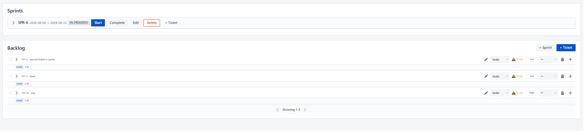
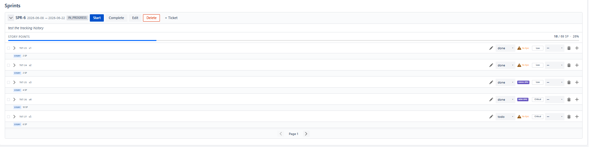
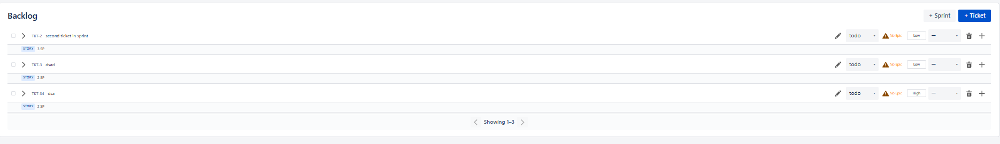
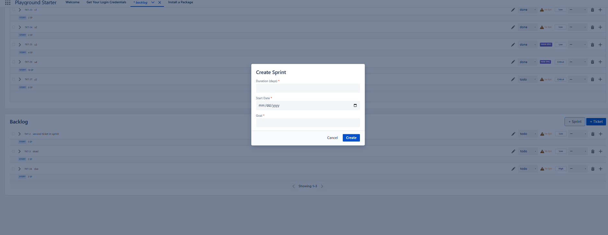
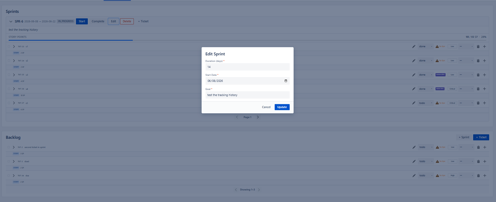
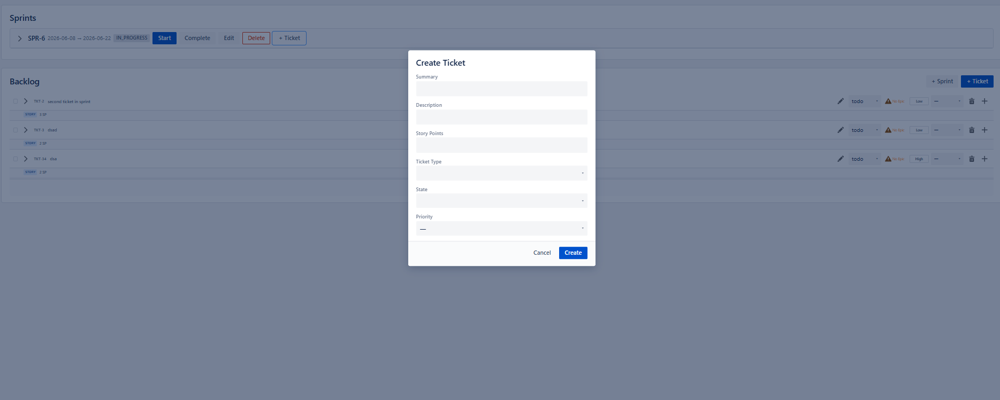
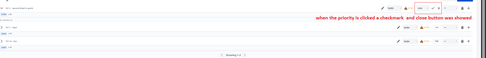
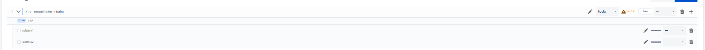
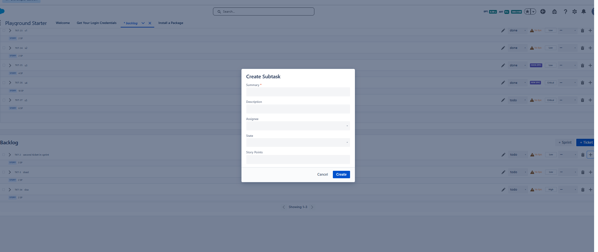
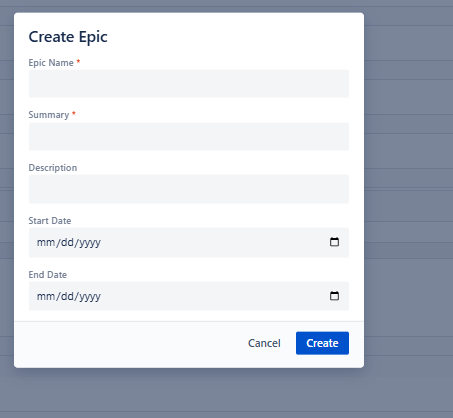

# Software Design Document (SDD) — Manage Backlog

**Feature:** Manage Backlog (Sprint planning board)
**Apex controller:** `force-app/main/default/classes/controller/managebacklog/ManageBacklogController.cls`
**LWC:** `force-app/main/default/lwc/manageBacklog/`
**Date:** 2026-06-20

> Image references below follow the requested marker convention: the image file name is wrapped
> between `###########################` lines, immediately before and after the embedded image.
> All images live in `force-app/backlog-images/`.

---

## 1. Architecture Overview

```
┌──────────────────────────── manageBacklog (parent LWC) ─────────────────────────────┐
│  State (principal): sprints[], backlogTickets[], statusOptions, memberOptions,        │
│                     ticketTypeOptions, epics, priorityOptions                         │
│  Derived (getters/utils): formatSprint(), enrichTickets(), formatTicket()             │
│                                                                                       │
│  Children:                                                                            │
│   • c-choose-project          → emits projectchosen                                   │
│   • c-ao-create-ticket-modal  → reusable Create-Ticket modal (backlog & sprint mode)  │
│   • c-ao-ticket-item          → one ticket row (delete, summary, status, priority,    │
│                                  assignee, epic, sub-tasks, select, drag handle)       │
│   • c-ticket-view             → right-side peek panel (links, subtasks, description)   │
│   • ao-* controls             → c-ao-btn / c-ao-input / c-ao-combobox / c-ao-checkbox  │
└───────────────────────────────────────────────────────────────────────────────────────┘
                    │  @salesforce/apex/ManageBacklogController.*
                    ▼
┌──────────────────── ManageBacklogController (APIResponse envelope) ──────────────────┐
│  Thin orchestration: blank-check inputs → DomainCorrectness.require* → delegate.       │
└───────────────────────────────────────────────────────────────────────────────────────┘
                    │
                    ▼
   SprintService · TicketService · StatusService · EpicService · ProjectService ·
   WorkflowService · ValidateFieldService · NameSequenceService · DomainCompleteValidator
```

**Response envelope.** Every controller method returns `APIResponse { success, message, data }`.
The LWC treats `success === false` (or a thrown Apex error) as failure and toasts the message.

**Data shape used by the page** (from `loadBacklogData`):
`{ sprints, status, ticketTypes, members, epics, backlogTickets, priorityOptions }`.

---

## 2. API Calls (Apex `@AuraEnabled` methods)

Legend: **C** = `cacheable=true` (wire-friendly), **I** = imperative (DML).

### 2.1 Page bootstrap & search
| Method | Kind | Params | Returns (`data`) | LWC usage |
|--------|------|--------|------------------|-----------|
| `loadBacklogData` | C | `projectId` | `{sprints,status,ticketTypes,members,epics,backlogTickets,priorityOptions}` | `_loadData()` imperative call on mount |
| `loadBacklogTickets` | C | `projectId, offset, pageSize` | `Ticket__c[]` | backlog Prev/Next paging |
| `loadTicketsBySprint` | C | `sprintId, offset, pageSize` | `Ticket__c[]` | sprint expand + paging |
| `loadTicketBySearchTerm` | C | `projectId, searchTerm` | `Ticket__c[]` (SOSL) | `@wire` ticket-view link search |
| `loadTicketTypes` | C | `projectId` | `TicketType__c[]` | (available) |
| `loadMembers` | C | `projectId` | `ProjectMember__c[]` | (available) |
| `getProjectStatuses` | C | `projectId` | `Status__c[]` | (available) |
| `loadUsers` | C | — | `User[]` | (available) |
| `loadProjects` | C | — | `Project__c[]` | choose-project |

### 2.2 Sprint lifecycle
| Method | Kind | Params | Effect |
|--------|------|--------|--------|
| `createSprint` | I | `duration, startDate, goal, projectId` | insert sprint (`future`, totals 0, name auto) |
| `updateSprint` | I | `sprintId, duration, startDate, goal` | update sprint fields |
| `startSprint` | I | `sprintId` | `future → in_progress` (one active per project) |
| `completeSprint` | I | `sprintId` | `in_progress → completed` (drops from page) |
| `deleteSprint` | I | `sprintId` | soft delete + clear `Sprint__c` on its tickets |

### 2.3 Ticket create / update / move / delete
| Method | Kind | Params | Effect |
|--------|------|--------|--------|
| `createTicketFromBacklog` | I | `summary, ticketTypeId, currentStateId, description, storyPoint, assignedToId, epicId, priority` | create sprint-less ticket |
| `createTicketFromSprint` | I | `…same… + sprintId` | create ticket in sprint + bump totals |
| `updateTicket` | I | `ticketId, summary, description, storyPoint, priority, assignedToId, currentStateId` | patch fields |
| `updateTicketSummary` | I | `ticketId, summary` | inline summary edit |
| `updateTicketDescription` | I | `ticketId, description` | description edit |
| `updateTicketPriority` | I | `ticketId, priority` | priority combo (✓) |
| `assignTicket` | I | `ticketId, memberId` | assignee combo |
| `changeTicketState` | I | `ticketId, fromStatusId, toStatusId` | workflow transition; returns `{isEndStatus, updatedSprint}` |
| `updateTicketEpic` | I | `ticketId, epicId` | set/clear epic |
| `moveTicketToSprint` | I | `ticketId, sprintId` | link + increase sprint totals; returns `{updatedSprint}` |
| `moveTicketToBacklog` | I | `ticketId` | unlink + decrease totals; returns `{updatedSprint}` |
| `moveTicketPosition` | I | `movedTicketId, beforeTicketId` | reorder (recompute `Score__c`); returns `{movedTicket}` |
| `deleteTicket` | I | `ticketId` | soft delete; returns `{updatedSprint}` |
| `deleteTickets` | I | `ticketIds[]` | bulk soft delete; returns `{updatedSprints}` |
| `linkToTicket` | I | `fromTicketId, toTicketId, linkType` | create ticket link; returns `{ticketLink}` |
| `loadTicketLinkedTo` | C | `ticketId` | `{ticketLinkTo[]}` |
| `loadTicketLinkedToType` | C | — | link-type options |

### 2.4 Epic
| Method | Kind | Params |
|--------|------|--------|
| `createEpic` | I | `name, summary, projectId, description, startDate, endDate` |
| `updateEpic` | I | `epicId, name, summary, description, startDate, endDate` |
| `getEpicsByProject` | C | `projectId` |
| `getEpicById` | C | `epicId` |

### 2.5 Sub-task
| Method | Kind | Params |
|--------|------|--------|
| `loadSubtasks` | C | `ticketId` |
| `createSubtask` | I | `summary, ticketId, description, assigneeId, currentStateId, storyPoint, startDate` |
| `updateSubtaskSummary` | I | `subtaskId, summary` |
| `updateSubtask` | I | `subtaskId, summary, description, assigneeId, currentStateId, storyPoint` |
| `assignSubtask` | I | `subtaskId, memberId` |
| `deleteSubtask` | I | `subtaskId` |
| `deleteSubtasks` | I | `subtaskIds[]` |

### 2.6 Wires actually bound in `manageBacklog.js`
- `@wire(loadTicketLinkedToType)` → `_ticketLinkedToTypeOptions`
- `@wire(loadTicketBySearchTerm, { projectId: '$_projectId', searchTerm: '$_ticketViewSearchTerm' })`
- `@wire(loadTicketLinkedTo, { ticketId: '$_linkedToTargetTicketId' })`
- `@wire(loadSubtasks, { ticketId: '$_subtasksTargetTicketId' })`

All other reads/writes are **imperative** Apex calls inside handlers (`then/catch/finally`),
flipping `isLoading` and toasting via `_showSuccess` / `_showError`.

---

## 3. Sequence Flows (key interactions)

**3.1 Page load**
```
mount → read localStorage.projectId
 ├─ none → render <c-choose-project>; on projectchosen → set _projectId → _loadData()
 └─ present → _loadData() → loadBacklogData(projectId)
                          → map: sprints.map(formatSprint), enrichTickets(backlog)
```

**3.2 Change ticket status**
```
c-ao-ticket-item ▸ ticketstatechange → changeTicketState(ticketId, from, to)
  success → _updateTicketStateEverywhere(ticketId, to)
          → if data.isEndStatus: _updateSprintStoryPoints(updatedSprint) + "no further transitions" toast
  failure → _reKeyTicket(ticketId) (revert combo) + error toast
```

**3.3 Backlog → Sprint drag**
```
dragstart (page) → record source container/ticket
drop on sprint   → moveTicketToSprint(ticketId, sprintId)
  success → _deleteBacklogTicket + formatSprint(updatedSprint)
          → if sprint expanded: _enrichSprintWithAddedTicket(...)
```

---

## 4. UI / UX Specification

### 4.1 Page load — Backlog + non-completed sprint containers
On load the page renders the **Sprints** panel (every `future`/`in_progress` sprint container,
collapsed) and the **Backlog** panel beneath it. Each sprint header carries the name, the
`StartDate → endDate` range, the status badge (e.g. `IN_PROGRESS`), and the action buttons
**Start / Complete / Edit / Delete / + Ticket**. The backlog header carries **+ Sprint** and **+ Ticket**.

###########################
load-page-state-v00.png
###########################

###########################
load-page-state-v00.png
###########################

### 4.2 Sprint container — dates, status, buttons, story-point line, paged tickets
Expanding a sprint shows the **goal** line, the **Story Points** progress line
(`ended / total SP · percent%` with a progress bar), the paged list of ticket containers
(5 per page, **Page N** with Prev/Next chevrons). This is the container that holds *many* ticket
containers and the total-vs-ended story-point indicator.

###########################
expand-sprint-state-v01.png
###########################

###########################
expand-sprint-state-v01.png
###########################

- **Start** → confirm → `startSprint` → status `future → in_progress`.
- **Complete** → confirm → `completeSprint` → status `in_progress → completed`; the sprint **no longer
  shows** on the page.
- **Edit** → opens the Edit-Sprint modal pre-filled with the current values.
- **Delete** → confirmation pop-up; on confirm `deleteSprint` (tickets returned to backlog).
- **+ Ticket** → opens the reusable Create-Ticket modal in *sprint* mode.

### 4.3 Backlog container — paged ticket rows
The backlog lists active, sprint-less tickets ordered by score, 5 per page, with a **Showing 1–N**
indicator and Prev/Next chevrons. Tickets can be dragged from here onto a sprint.

###########################
backlog-container.png
###########################

###########################
backlog-container.png
###########################

### 4.4 Create-Sprint modal (+ Sprint)
Fields: **Duration (days)** \*, **Start Date** \*, **Goal** \*. Buttons **Cancel** / **Create**.
Submitting calls `createSprint(duration, startDate, goal, projectId)`.

###########################
create-sprint-modal.png
###########################

###########################
create-sprint-modal.png
###########################

### 4.5 Edit-Sprint modal (Edit)
Same fields as create, **pre-filled** with the sprint's current Duration / Start Date / Goal.
Button label is **Update**; submitting calls `updateSprint(sprintId, duration, startDate, goal)`.

###########################
edit-sprint-modal.png
###########################

###########################
edit-sprint-modal.png
###########################

### 4.6 Create-Ticket modal (+ Ticket — reused across the project)
The single `c-ao-create-ticket-modal` is reused for both backlog and sprint creation. Fields:
**Summary**, **Description**, **Story Points**, **Ticket Type**, **State**, **Priority**.
Buttons **Cancel** / **Create**. In sprint mode the modal receives `sprint-id` and the parent calls
`createTicketFromSprint`; otherwise `createTicketFromBacklog`.

###########################
create-ticket-modal.png
###########################

###########################
create-ticket-modal.png
###########################

### 4.7 Ticket container (row)
A row shows the ticket **name**, **summary**, **epic** label (**No Epic** when unset, clickable),
**current status** combo, **priority** combo, **assignee** combo, plus the type/story-point chip
(e.g. `STORY 3 SP`). Trailing controls: edit-summary (pencil), epic label, status combo, priority
combo, assignee combo, delete (trash), and add-subtask (**+**). The leading chevron expands the
sub-tasks; the leading checkbox selects for bulk delete.

###########################
ticket-container-row.png
###########################

###########################
ticket-container-row.png
###########################

### 4.8 Change priority — combo with confirm (✓) and close (✕)
Clicking the priority combo reveals a **checkmark** (confirm) and a **close** button. Confirming
validates the value (Critical / High / Medium / Low) and calls `updateTicketPriority`.

###########################
change-priority-value.png
###########################

###########################
change-priority-value.png
###########################

### 4.9 Expand ticket — sub-tasks list
The ticket's expand chevron lazy-loads (`loadSubtasks`) and lists its sub-tasks beneath the row.
Each sub-task supports summary edit, assignee change, and delete.

###########################
show-sub-task-for-ticket-container.png
###########################

###########################
show-sub-task-for-ticket-container.png
###########################

### 4.10 Create-Subtask modal (+ on a ticket)
Fields: **Summary** \*, **Description**, **Assignee**, **State**, **Story Points**.
Buttons **Cancel** / **Create**; submitting calls `createSubtask`.

###########################
create-sub-task-modal.png
###########################

###########################
create-sub-task-modal.png
###########################

### 4.11 Update Epic Parent modal (epic label → choose existing or create new)
Clicking the epic label opens the epic modal. The user can pick an existing epic or **create a new
one**. The create form fields: **Epic Name** \*, **Summary** \*, **Description**, **Start Date**,
**End Date**. Creating calls `createEpic` then `updateTicketEpic`; choosing an existing epic calls
`updateTicketEpic` directly.

###########################
create-epic-modal.png
###########################

###########################
create-epic-modal.png
###########################

---

## 5. State, Paging & Drag-and-Drop Design

- **Paging.** `PAGE_SIZE = 5` (`backlogSprintUtils.js`). Backlog tracks `backlogOffset / backlogHasMore`;
  each sprint tracks its own `offset / hasMore / currentPage / isFirstPage / isLastPage / offsetLabel`.
  "has more" is inferred from `rawTickets.length === PAGE_SIZE`.
- **Derived sprint view-model.** `formatSprint(raw)` adds `endDate` (= start + duration days),
  `isComplete`, `storyPointsPercent`, chevron/expansion/paging defaults, and drag-feedback classes.
- **Derived ticket view-model.** `enrichTickets(...)` / `formatTicket(...)` map `epicName`,
  `ticketTypeName`, `assigneeName`, `isSelected`, a stable `_key`, and `dropIndicatorClass`.
- **Mutators are "everywhere"-aware.** Because a ticket can appear in the backlog and (when loaded)
  in a sprint, patches go through `_patchTicketEverywhere` / `_updateTicket…Everywhere` so both copies
  stay consistent without a second fetch.
- **Drag and drop.** `handlePageDragStart` records the source container/ticket via DOM traversal
  (dataTransfer is empty on `dragstart`). Sprint→different-sprint is blocked (`dropEffect='none'`).
  Same-container drops route to `moveTicketPosition` (reorder); cross-container drops route to
  `moveTicketToSprint` / `moveTicketToBacklog`. Top drop-zones allow inserting before the first item.
- **Optimistic revert.** On a failed status change the ticket is re-keyed (`_reKeyTicket`) to force the
  combo to re-render its server value.

---

## 6. Error Handling & Loading
- Each imperative call sets `isLoading = true`, then in `finally` resets it; `success === false`
  throws inside `then` so the shared `catch` toasts `err.body?.message || err.message`.
- Page-level load failure sets `errorMessage` and hides content (`shouldShowContent`).
- Confirmations (`_confirm`) gate destructive actions (sprint delete, bulk delete) behind the
  confirmation dialog before any Apex call.

---

## 7. Traceability (SRS → API)
| SRS | API call(s) |
|-----|-------------|
| FR-2 page load | `loadBacklogData` |
| FR-4 / FR-8 paging | `loadBacklogTickets`, `loadTicketsBySprint` |
| FR-9..FR-13 sprint actions | `startSprint`, `completeSprint`, `updateSprint`, `deleteSprint` |
| FR-14/FR-15 create ticket | `createTicketFromBacklog`, `createTicketFromSprint` |
| FR-17 inline ops | `updateTicketSummary`, `changeTicketState`, `updateTicketPriority`, `assignTicket`, `updateTicketEpic`, `deleteTicket` |
| FR-18 epic | `createEpic`, `updateTicketEpic`, `getEpicsByProject` |
| FR-19 bulk delete | `deleteTickets` |
| FR-20/FR-21 sub-tasks | `createSubtask`, `loadSubtasks`, `updateSubtaskSummary`, `assignSubtask`, `deleteSubtask`, `deleteSubtasks` |
| FR-22..FR-24 move/reorder | `moveTicketToSprint`, `moveTicketToBacklog`, `moveTicketPosition` |
| FR-25 peek panel links | `loadTicketLinkedTo`, `loadTicketLinkedToType`, `linkToTicket`, `loadTicketBySearchTerm` |
